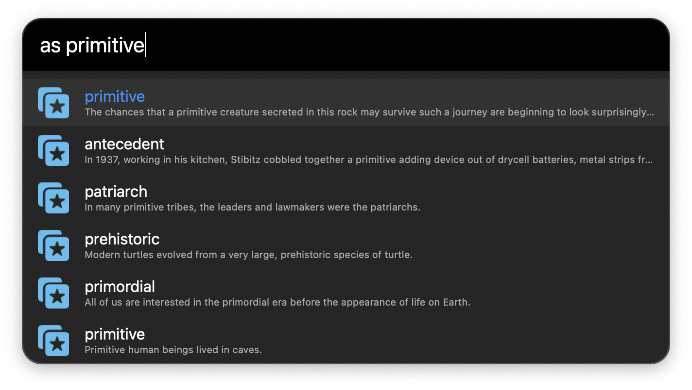

# Anki Search Workflow

## Setup

- `Front Fields`: Specify fields for search results' titles.
- `Back Fields`: Specify fields for search results' subtitles.

## Usage

- Use `as` to search notes. Hit `ENTER` to open results in the Anki Browser.
- Use `at` to list all tags.

## Dependencies

- [Anki-Connect](https://github.com/FooSoft/anki-connect)

## Additional Anki Utilities

- [anki_tools](https://github.com/cdpath/anki_tools)

